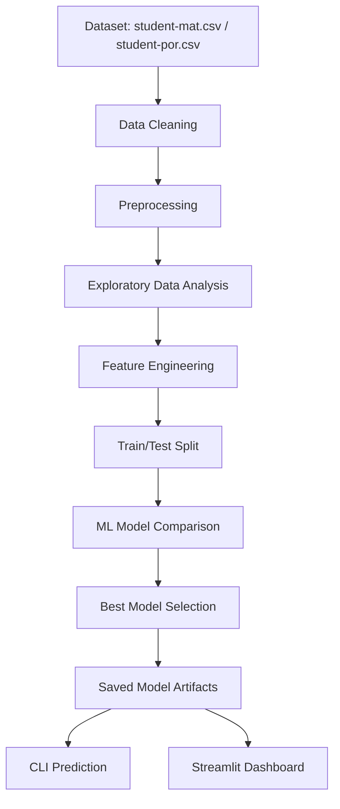

<div align="center">

# AI-Driven Student Performance Prediction System

Production-style machine learning project for predicting student pass/fail outcomes using academic, demographic, family, and lifestyle data.


</div>

## Overview

This repository contains an end-to-end machine learning system that predicts whether a student is likely to pass based on the Kaggle Student Performance dataset. It includes data cleaning, preprocessing, EDA, feature engineering, model comparison, automated best-model selection, model persistence, a command-line prediction utility, and a professional Streamlit dashboard.

The project is structured as a GitHub portfolio project suitable for an AI/ML internship, college major project, or applied machine learning demonstration.

## Problem Statement

Educational institutions often need early indicators of academic risk so they can provide timely intervention. This project builds a binary classification system that predicts whether a student will pass using historical grade information and contextual student attributes.

The target variable is:

```text
pass = 1 if final grade G3 >= 10
pass = 0 if final grade G3 < 10
```

## Objectives

- Build a reproducible machine learning pipeline.
- Clean and preprocess the Kaggle Student Performance dataset.
- Encode categorical variables and scale numeric features.
- Generate professional exploratory and evaluation visualizations.
- Train and compare five supervised learning models.
- Automatically select the best model using ROC-AUC and accuracy.
- Save reusable model artifacts as `.pkl` files.
- Provide a Streamlit dashboard for interactive prediction.
- Document the project clearly for GitHub and academic review.

## Dataset

This project uses the Kaggle Student Performance dataset, originally sourced from the UCI Machine Learning Repository.

Expected files:

- `student-mat.csv`: Mathematics course records
- `student-por.csv`: Portuguese course records

Place one or both files in:

```text
data/raw/
```

CSV files are intentionally ignored by Git to avoid committing raw dataset files.

## Project Architecture



## Folder Structure

```text
AI-Driven Student Performance Prediction System/
|-- app/
|   `-- streamlit_app.py
|-- data/
|   |-- processed/
|   `-- raw/
|       `-- README.md
|-- models/
|   `-- README.md
|-- notebooks/
|   `-- student_performance_workflow.ipynb
|-- outputs/
|   |-- figures/
|   `-- README.md
|-- reports/
|   |-- Project_Report.md
|   `-- README.md
|-- src/
|   |-- __init__.py
|   |-- config.py
|   |-- data_preprocessing.py
|   |-- eda.py
|   |-- predict.py
|   `-- train.py
|-- .gitignore
|-- CHANGELOG.md
|-- CODE_OF_CONDUCT.md
|-- CONTRIBUTING.md
|-- LICENSE
|-- README.md
`-- requirements.txt
```

## Installation

Create a virtual environment:

```bash
python -m venv .venv
.venv\Scripts\activate
```

Install dependencies:

```bash
pip install -r requirements.txt
```

## Usage

### 1. Add Dataset Files

Download the Kaggle dataset and place the files in `data/raw/`:

```text
data/raw/student-mat.csv
data/raw/student-por.csv
```

### 2. Train and Evaluate Models

```bash
python -m src.train
```

Generated artifacts:

- `models/best_model.pkl`
- `models/model_metadata.pkl`
- `reports/model_comparison.csv`
- `reports/classification_report.txt`
- `reports/feature_importance.csv`
- `outputs/figures/correlation_heatmap.png`
- `outputs/figures/feature_importance.png`
- `outputs/figures/confusion_matrix.png`
- `outputs/figures/roc_curve.png`
- `outputs/figures/precision_recall_curve.png`
- `outputs/figures/class_distribution.png`
- `outputs/figures/model_accuracy_comparison.png`

### 3. Predict from CLI

```bash
python -m src.predict --input "{\"subject\":\"mathematics\",\"school\":\"GP\",\"sex\":\"F\",\"age\":17,\"address\":\"U\",\"famsize\":\"GT3\",\"Pstatus\":\"T\",\"Medu\":4,\"Fedu\":4,\"Mjob\":\"teacher\",\"Fjob\":\"services\",\"reason\":\"course\",\"guardian\":\"mother\",\"traveltime\":1,\"studytime\":2,\"failures\":0,\"schoolsup\":\"yes\",\"famsup\":\"no\",\"paid\":\"no\",\"activities\":\"yes\",\"nursery\":\"yes\",\"higher\":\"yes\",\"internet\":\"yes\",\"romantic\":\"no\",\"famrel\":4,\"freetime\":3,\"goout\":3,\"Dalc\":1,\"Walc\":1,\"health\":4,\"absences\":2,\"G1\":15,\"G2\":14}"
```

### 4. Run Streamlit Dashboard

```bash
streamlit run app/streamlit_app.py
```

The dashboard includes:

- Sidebar navigation
- Professional dark theme
- Prediction probability
- Confidence level
- Risk assessment
- Model information
- Metric cards
- Downloadable prediction CSV
- Visualization viewer

## Models Compared

- Logistic Regression
- Decision Tree
- Random Forest
- Gradient Boosting
- Support Vector Machine

The best model is selected by ROC-AUC, with accuracy as a secondary ranking metric.

## Evaluation Metrics

The training pipeline reports:

- Accuracy
- Precision
- Recall
- F1 Score
- ROC-AUC

## Screenshots

Add generated screenshots to `outputs/screenshots/` after running the dashboard.

Recommended screenshots:

- Prediction dashboard
- Model information page
- Visualization page
- Confusion matrix
- ROC curve

## Results

Model results are generated automatically in:

```text
reports/model_comparison.csv
```

The Streamlit dashboard reads the saved metadata and displays the selected model, metrics, confidence, risk level, and recommendation.

## Future Scope

- Add hyperparameter tuning with `GridSearchCV`, RandomizedSearchCV, or Optuna.
- Add cross-validation and confidence intervals for model metrics.
- Track experiments with MLflow.
- Add SHAP-based model explainability.
- Deploy the dashboard to Streamlit Community Cloud.
- Add authentication and batch prediction support.
- Expand the target from binary pass/fail to multiclass grade bands.

## Acknowledgements

- Kaggle Student Performance dataset
- UCI Machine Learning Repository
- scikit-learn
- Streamlit
- pandas, NumPy, Matplotlib, and Seaborn

## License

This project is licensed under the MIT License.
