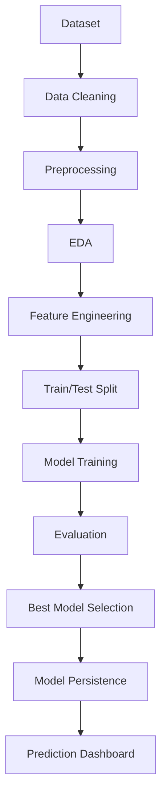

# Project Report: AI-Driven Student Performance Prediction System

## Abstract

This project presents an end-to-end machine learning system for predicting student pass/fail outcomes using the Kaggle Student Performance dataset. The system processes academic, demographic, family, and lifestyle attributes, compares multiple supervised learning algorithms, selects the best-performing model, and exposes predictions through both a command-line interface and Streamlit dashboard.

## Introduction

Student performance prediction is an important educational analytics task. Early identification of students at academic risk enables institutions to provide targeted support, mentoring, and intervention. This project frames student performance as a binary classification problem where the goal is to predict whether a student will pass based on final grade thresholding and contextual features.

## Literature Survey

Prior educational data mining work commonly uses classification algorithms such as Logistic Regression, Decision Trees, Random Forests, Support Vector Machines, and Gradient Boosting for performance prediction. Ensemble models often perform well because they capture non-linear relationships and feature interactions. Linear models remain valuable as interpretable baselines, while SVMs can be effective on medium-sized structured datasets after preprocessing.

## Methodology

The workflow follows a production-style machine learning pipeline:



Key steps include duplicate removal, categorical normalization, pass/fail target creation, missing-value imputation, one-hot encoding, numeric scaling, model training, metric comparison, and artifact persistence.

## Dataset

The project uses the Kaggle Student Performance dataset, originally from the UCI Machine Learning Repository. It includes student records from Mathematics and Portuguese courses. Features include school, sex, age, family background, parent education, study time, failures, support indicators, social behavior, absences, and period grades.

The binary target is created as:

```text
Pass = 1 if G3 >= 10
Fail = 0 if G3 < 10
```

The final grade `G3` is removed from model features to avoid target leakage.

## Algorithms

The following algorithms are trained and compared:

- Logistic Regression
- Decision Tree
- Random Forest
- Gradient Boosting
- Support Vector Machine

Each model is wrapped in a scikit-learn pipeline that applies preprocessing before model fitting.

## Results

The pipeline evaluates models using:

- Accuracy
- Precision
- Recall
- F1 Score
- ROC-AUC

Results are saved to:

```text
reports/model_comparison.csv
```

The best model is selected using ROC-AUC as the primary metric and accuracy as the secondary metric. Visual outputs include a confusion matrix, ROC curve, precision-recall curve, feature importance chart, class distribution, model accuracy comparison, and correlation heatmap.

## Conclusion

The project demonstrates a complete applied machine learning workflow from raw data to deployable prediction dashboard. The final system can help identify students who may need academic support while providing transparent metrics and visualizations for evaluation.

## Future Scope

- Add cross-validation for more robust model comparison.
- Add hyperparameter optimization.
- Include SHAP or LIME explanations.
- Add batch prediction for multiple students.
- Deploy the dashboard to a cloud platform.
- Extend the target into multiclass performance categories.
